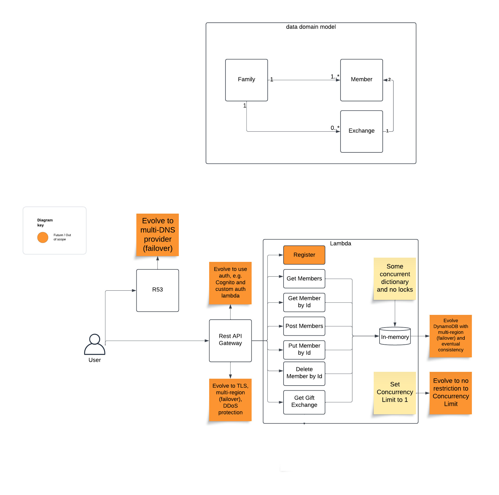
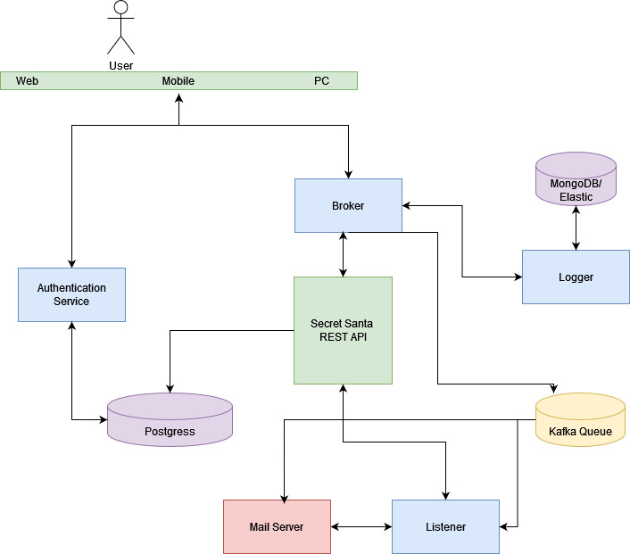

This project is done as a take home exercise that it's meant to be completed in a few hours. It needs to prove good code and good architecture. A good app is more like good code and good architecture, Security best practices, 
secure coding and scalability are also important. I'll try to cover all the additions that should be done in test of security and best practices here. I assume that a few hours are not enough to build a microservices environment therefore I'll try to explain the design and how this microservice will fit in a microservices environment and the position against the rest of the services.

* Rationale 

The initial thoughts was to have a serverless solution. It would be fast and also with AWS (for example) and API gateway you get throttling and other security features for free. Also maintenance cost is very low.
However, this plan wouldn't prove my efficiency to create a scalable, service written in Go from scratch.

Since this is a take home exercise and not a live coding exercise, I can't ask any questions therefore, all the decision need to be done asynchronously.
I think the initial ask is to implement the REST API satisfying the functional requirements described and also showing good grasp of TDD and clean code principles 
Given that this is meant to be completed in a few hours, I assume that the whole microservices environment is out of scope. However, I would like to propose a system design to have an idea  where this service belongs.

In the beginning it needs to be clear thatREST APIs and microservices are related but distinct concepts in software architecture.
This exercise asks for a REST API but you can't start implementing a REST API to be isolated from the rest of the planet.

Future Enhancements:
Except to the core logic that is mostly included in this repo there's a plethora of future enhancements to add security, Scalability, Fault tolerance and extensibility.
* Logging (a logger service)
* Asynchronous workflows with Kafka, although the basic functionality doesn't need any messaging desing and GRPC calls between services is fine, a messaging system will be important for asynchronous workflows, for example a mail server that needs to send an email to the recipients.
* Persistence with PostgreSQL/MongoDB for long-term storage

Extensibility:
* Mail Server to notify members of their gift assignments. 
* Monitoring or analytics using Elastic.
* The system could possibly in the future grow to host a company's secret santa or even more, like a TV/Radio show gift excange.

Assumptions :
* Who shuffles? What is a secret santa session? In this case and since there's no separate kick point of a session the system will shuffle anytime some will GET/gift_exchange. This is not thread safe.
Ideally a secret santa session happens every Xmass or other occasions, happens once and probably any user would like to GET/gift_exchange and get the whole list, or just another interface to GET/gift_exchange:userID to get the pair that should buy a present for.
* 

Proposals for Future Additions in AuthN/AuthZ
Authentication (AuthN) Enhancements :
* Token-Based Authentication:
    Implement JWT (JSON Web Tokens) for secure user authentication. Each user would authenticate using credentials and receive a token for subsequent API calls.
    Tokens will include expiry times to ensure they are short-lived for added security.
* OAuth2 Integration:
    Introduce third-party authentication providers (e.g., Google, GitHub) using OAuth2 for seamless and secure login.
    This reduces the need to manage user passwords directly.
* Password Management:
  Use secure hashing algorithms such as bcrypt or Argon2 for storing passwords if custom login functionality is introduced.
  Enforce strong password policies for additional security.
* Rate limiter: Maybe in the future if a secrewt santa goes public we need a rate limiter to mitigate attacks

* Authorization (AuthZ) Enhancements
* Role-Based Access Control, like admins to add/delete members, or someone to be have the right to shuffle
* Token Scopes and Permissions
  Use OAuth2 scopes to define permissions for each token

What is missing from this MVP that need to be added as soon as possible.
* Extensive Unit test and Mocks - Apart from the fact that unit tests are crucial to discover issues and confirm that any changes are safe and didn't broke something they are also useful for TDD. Here they are very crucial to enhance profiling tools like go leak, panic parse, pprof etc. There are some but in general I prefer ~100% coverage when I have the time to do it.
* Validate inputs - all inputs by users needs to be validated. Not only to avoid bad actors that may try (i.e. SQL injection). https://github.com/securego/gosec is good tool to check SQL injection, Hardcoded credentials, missing inputs etc.
* Extensive System test - There are some basic scenarios just as showcase, there's a need to cover any possible behaviour and added in CI/CD (etc github actions)
* 